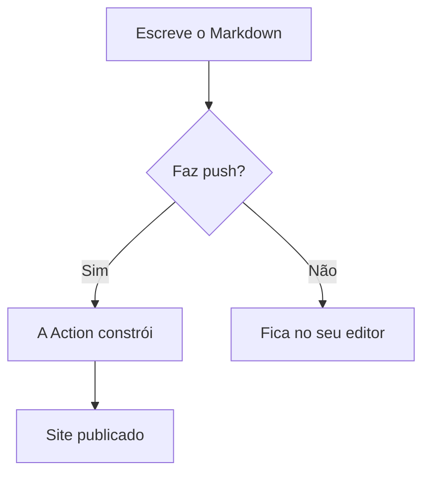
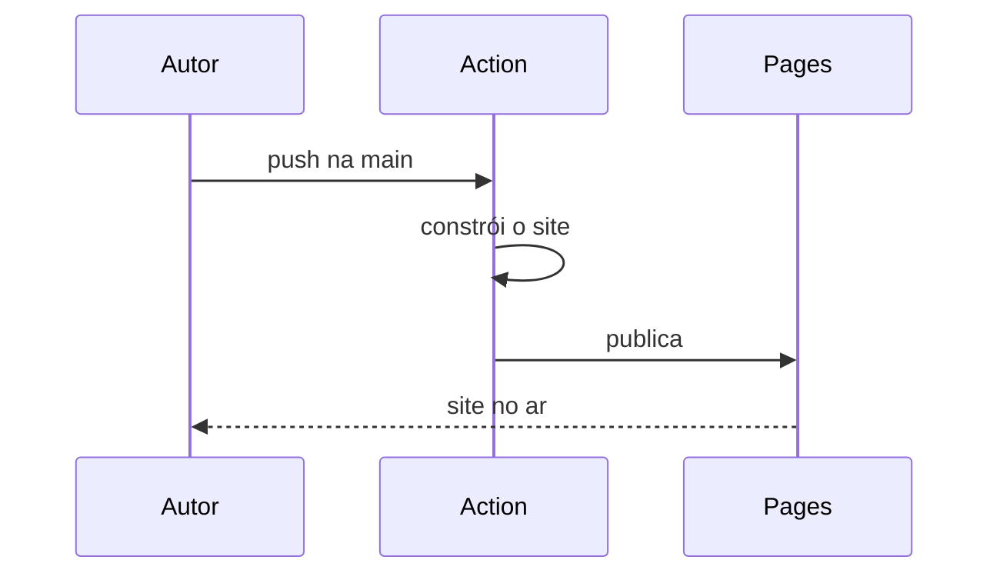

<Intro>
  Diagramas do [Mermaid](https://mermaid.js.org/) são escritos como texto, dentro de um bloco de
  código. Eles se adaptam sozinhos ao tema claro e escuro.
</Intro>

## Fluxograma

````md

````

resultado:


## Diagrama de sequência

````md

````

resultado:


Como o diagrama é texto, ele vive no mesmo commit da mudança que descreve, e o diff mostra o que
mudou nele.
